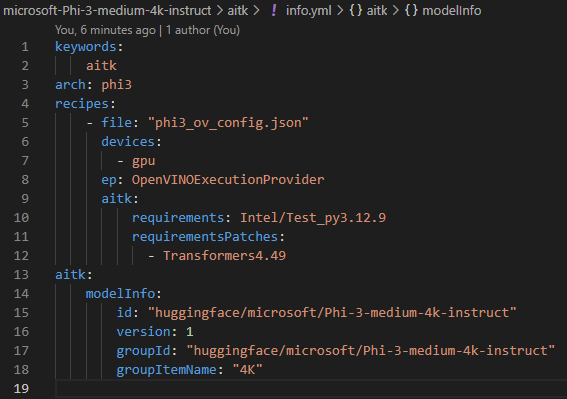
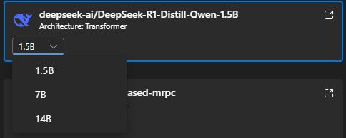
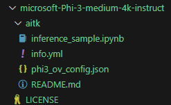
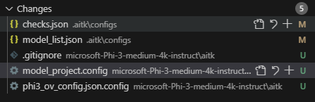

# Get started to add new recipe

## Overview

In general, the following steps should be done to submit recipes to AITK and these are summary of what they do

| Name | Summary |
|-|-|
| Create Folder | Create folder for new model |
| Create Olive recipes | Add Olive recipes for converting the model |
| Create Requirements file (optional) | Create file to configure stand-alone Python venv |
| Create info.yml | Info.yml is used to describe the olive recipes and AITK project |
| Run sanitize.py | Sanitize.py will help to validate and generate additional files for AITK |
| Test in AITK | Do E2E test |
| Submit pr | Include necessary files, changes and metrics |

### Demo

In this demo pr, we will add microsoft/Phi-3-medium-4k-instruct with one intel gpu recipe. Refer to [Hualxie/demo by xieofxie · Pull Request #31 · microsoft/olive-recipes](https://github.com/microsoft/olive-recipes/pull/31/files).

## Create Folder

In the root folder, create a folder in the name of organization-model like `microsoft-Phi-3-medium-4k-instruct`. Each model should has its own folder with its own LICENSE.

Then inside it, create

- LICENSE: the model license
- Subfolders: could be any name. For example
    - aitk: all aitk maintained recipes.
    - NvTensorRtRtx: recipes for NVIDIA TensorRT for RTX

In this case, since it is a new model and we want to show it in AITK, we use aitk

## Create Olive recipes

In the aitk folder, create the following files to do the conversion and inferencing. These files are required.

- xxx.json: olive config
- inference_sample.ipynb: how the model could be used via WinML. Could copy from similar projects
- README.md: 
    - describe how xxx.json works
    - include evaluation result like latency, accuracy, throughput etc. (together with device info)

## Create Requirements file (optional)

In AITK, the recipe conversion and evaluation process are separated. They could use same venv or totally different ones.

- For P0 models, these venvs will be maintained by MS and whenever they have updates, P0 recipes will also be verified.
- For other models, a venv setup for conversion is required. So once verified and checked in, end users could always reliably convert the model.
- For other models, evaluation venv will be aligned with P0’s. Because model should always be able to run in latest WinML runtimes.

To create such file, please

- Create a clean venv and install all needed packages
- Use pip freeze to save the requirements into `.aitk/requirements/XXX/YYY_py3.12.9.txt`
    - Python version is also flexible as long as it is in uv supported list [Python versions | uv](https://docs.astral.sh/uv/concepts/python-versions/#viewing-available-python-versions)
    - Choose a python version that most packages have already built against it. For example, onnx 1.17.0 build against 312 but [not latest 313](https://pypi.org/pypi/onnx/1.17.0/json)

For a certain period of time / a bunch of recipes, **the venv should be shared** to avoid creating too many different venv in end user’s computer.

In demo pr, we use [olive-recipes/.aitk/requirements/Intel/Test_py3.12.9.txt at main · microsoft/olive-recipes](https://github.com/microsoft/olive-recipes/blob/main/.aitk/requirements/Intel/Test_py3.12.9.txt)

### Create venv patch file

If recipes need a venv that is only a little different from another one, we could use patch to avoid creating a new venv.

It will be in the format of .aitk/requirements/XXX/YYY_py3.12.9-ZZZ.txt. ZZZ is the patch name.

In demo pr, we use [olive-recipes/.aitk/requirements/Intel/Test_py3.12.9-Transformers4.49.txt at main · microsoft/olive-recipes](https://github.com/microsoft/olive-recipes/blob/main/.aitk/requirements/Intel/Test_py3.12.9-Transformers4.49.txt) to bump version of transformers lib.

### Venv file special commands (WIP)

We support special commands to enable better venv setup. See [Requirement Special Commands](../guide/ReqCommands.md).

## Create info.yml

Create the required yml file to describe the project

For example:

Explanations

- recipes.devices: the list of devices that recipe supports: cpu, gpu, npu
- recipes.ep / eps: the list of Eps that recipe supports
- recipes.aitk.requirements: requirement file explained above
- recipes.aitk.requirementsPatches: patch file explained above
- aitk.modelInfo.id: a unique name in aitk. Usually huggingface/ORG/MODEL_NAME
- aitk.modelInfo.version: when config or inference sample has breaking updates, increase this number and AITK will ask user to upgrade their recipes
- aitk.modelInfo.groupId: (optional) If we want to group multiple models together like for different size, we could set it
- aitk.modelInfo.groupItemName: (optional) the name shown in dropdown

Grouping is like

After these steps, all new files are like

## Run sanitize.py

Run .aitk/scripts/sanitize.py to config and generate AITK specific files. These files are optional for pr creator as they are auto-generated (but need to commit for AITK).

- checks.json: sanity check for changes
- model_list.json: you could see that new model is correctly added
- .gitignore: default pattern for AITK project files
- model_project.config: list recipes same as info.yml
- xxx.json.config: UX definition file for xxx.json. Automatically generated for llm model now
    - For new recipes, we may need to work together for generation

You could also see warnings for your project:

- requirements.txt not exists: This file is optional. If provided, we will install the packages in it in our default venv. The purpose of this file is to enable user to add packages he needed for updated inference sample or olive json
    - This file is not the config for conversion or inference venv
- inference_model.json not exists: this is for adding converted model to AITK catalog. If tested, we could add that

Now the changed files are

### XXX.json.config Explanation (WIP)

[UxConfig.md](./UxConfig.md)

## Test in AITK

Run `.aitk/scripts/pack_to_extension.py` and it will pack current local olive-recipes repo into installed AITK extension. So you could test in your local branch first before pushing to olive-recipes.

After the script, reopen VS Code to restart the AITK, you should see it in the model list

It will be converted via your specified environment and run in current WCR environment from AITK.

### Test in AITK source code

Run `npm run zip-template`. It will pack olive-recipes into windows-ai-studio-templates first then pack windows-ai-studio-templates into resources/template.zip for extension debugging.

## Submit pr

With all these changes and new files, now you could submit the pr.
The sanitize.py will run again during pr validation, so make sure all changes are commited.

When we review the pr, we will look at the metrics in README.md to make sure the model is converted and running correctly.
